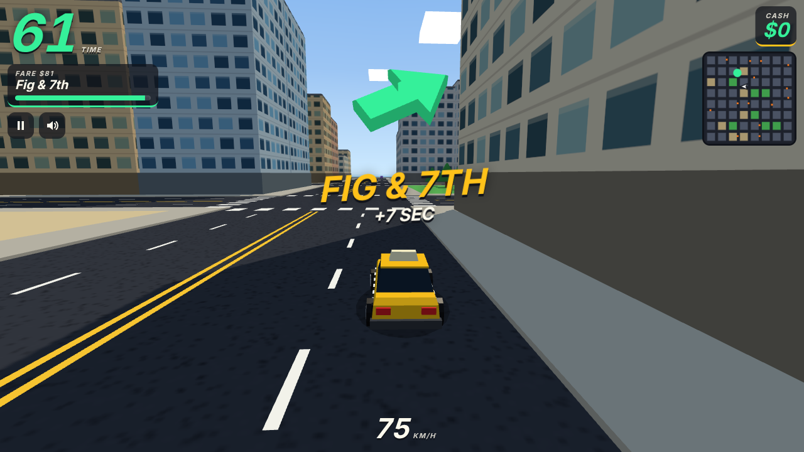
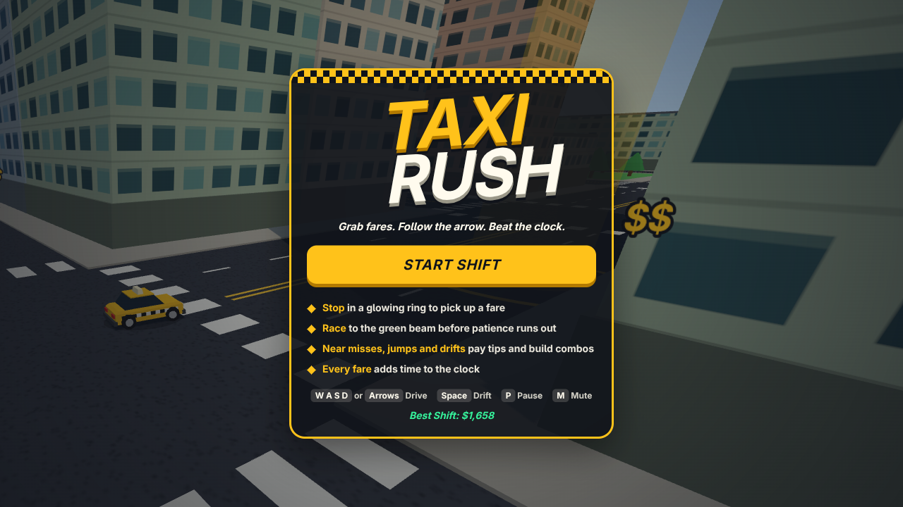
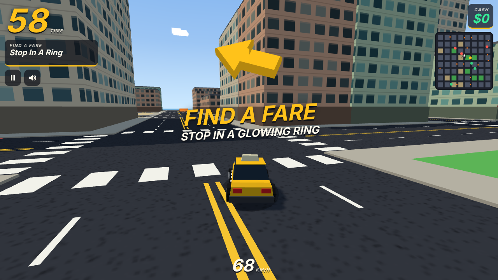
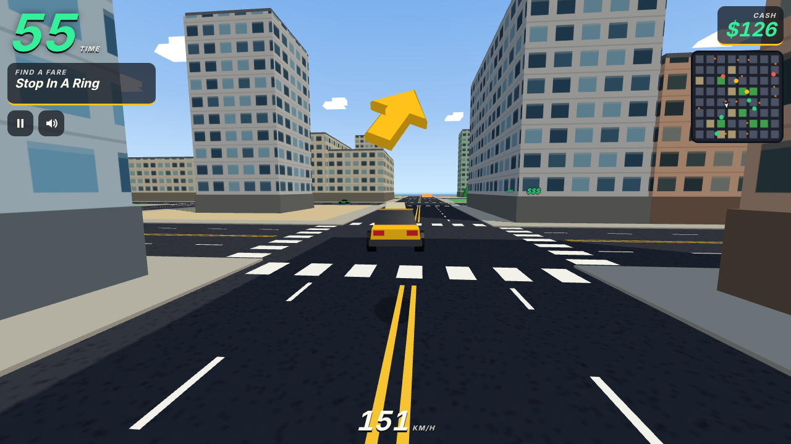
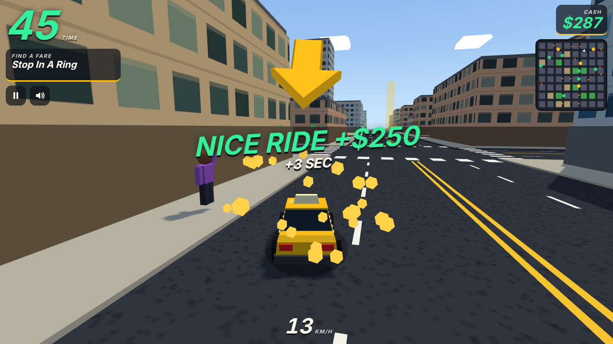
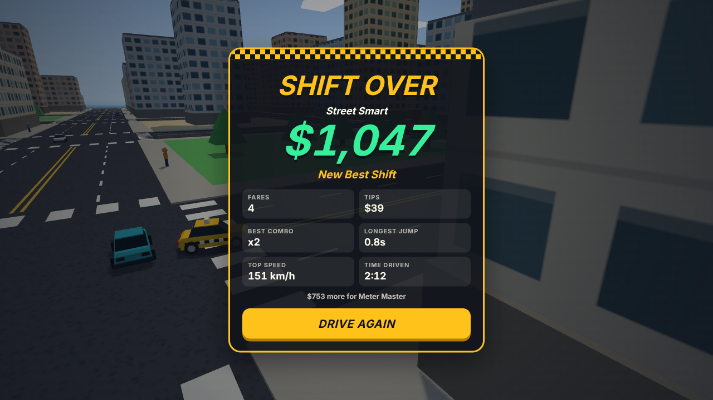
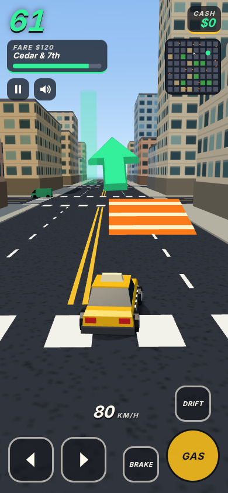

<div align="center">
  
  <h1 align="center" style="border-bottom: none">Taxi Rush</h1>
  <h3 align="center">an arcade taxi game for the browser, built with three.js, typescript, and vite</h3>
</div>

Grab a fare. Follow the big arrow. Beat the clock. Every passenger you deliver adds time, and every near miss, jump and drift pays a tip. When the clock hits zero, your shift is over.

## Quick Start

```bash
npm install
npm run dev
```

Open http://127.0.0.1:5183 and press **Start Shift**.

## How To Play

1. Drive to a passenger and **stop inside the glowing ring**.
2. Follow the arrow to the **green beam** and stop inside it.
3. Get there fast. A quick trip pays more and adds more time.
4. Drive with style between fares. Tips stack into a combo of up to x8.
5. Hit anything and the combo is gone.

Passengers are marked by how far they want to go: `$` is a short hop, `$$$` is across town. Longer trips pay more and add more time at pickup.

## Controls

| Action | Keyboard | Touch | Gamepad |
|---|---|---|---|
| Gas | `W` or `Up` | Gas | Right trigger or A |
| Brake and reverse | `S` or `Down` | Brake | Left trigger or B |
| Steer | `A` `D` or `Left` `Right` | Arrow buttons | Left stick or d-pad |
| Drift | `Space` or `Shift` | Drift | X |
| Pause | `P` or `Esc` | Pause button | |
| Mute | `M` | Speaker button | |

## Screenshots

| | |
|---|---|
|  |  |
|  |  |
|  |  |

## What's Included

### Game

- **Fares with a patience meter** that pay more for speed
- **Time bonuses** at pickup and drop-off that shrink as the shift goes on, so every run ends
- **Tips** for near misses, jumps and drifts, with a combo multiplier
- **Launch ramps** on the streets and parks you can cut through
- **Traffic** that keeps to its lane, turns at crossings and spins out when hit
- **Ranks** from Learner's Permit to City Legend, and a best score saved on the device

### Feel

- **Chase camera** that widens with speed and shakes on impact
- **Destination arrow** fixed at the top of the screen
- **Minimap** with fares, ramps and the destination
- **Synth engine, tire squeal, effects and music**, all made in code with WebAudio
- **Self-driving demo** behind the title screen

### Platform

- **Desktop and phone**, in portrait or landscape
- **Keyboard, touch and gamepad**
- **No login, no backend, no downloads**. Every model, texture and sound is generated at load.

## Tech Stack

| Technology | Version | Purpose |
|---|---|---|
| **Three.js** | 0.186.0 | 3D rendering |
| **TypeScript** | 7.0.2 | Language |
| **Vite** | 8.3.0 | Dev server and build |
| **Vitest** | 5.0.1 | Unit tests |

Three.js is the only runtime dependency.

## Architecture

The game rules live in `src/game` and know nothing about the browser. They take a seed and a stream of inputs, and they always play out the same way. That makes them easy to test, and it lets an autopilot play whole runs in the test suite.

| Folder | Holds |
|---|---|
| `src/game` | City generator, car physics, traffic, fares, tips, autopilot |
| `src/render` | Three.js scene, models, camera, particles |
| `src/ui` | HUD, minimap, menus |
| `src/input` | Keyboard, touch, gamepad |
| `src/audio` | Engine, effects, music |

```ts
import { createGame, stepGame, drainEvents } from './game/game.ts';

const game = createGame(2026);
stepGame(game, { throttle: 1, steer: 0, handbrake: false }, 1 / 60);
for (const event of drainEvents(game)) console.log(event.type);
```

## Testing

```bash
npm test            # unit tests
npm run simulate    # print the results of eight autopilot runs
```

## Build

```bash
npm run build
```

This writes a static site to `dist/`. It uses relative paths, so it can be served from any folder on any static host.

Share cards link to `https://taxi-rush.grok.me` by default. Set `VITE_SITE_URL` to change it.

Page-view analytics are off unless the build is given `VITE_ANALYTICS_SRC` and `VITE_ANALYTICS_ID`. See `.env.example`.

## License

MIT. See [LICENSE](LICENSE).
